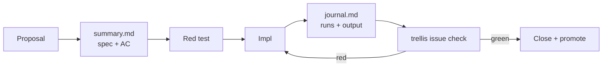

# Issue docs — the empirical wedge practice

Carried over from `pi-sprite/examples/webcontainer-react`, where this loop was
first formalized (`docs/issues/TRL-166 … TRL-199`). Same shape, adapted to an
MV3 Chrome extension.

The rule the practice exists to enforce:

> **A wedge is not done when the code looks right. It is done when a command
> proves it.**

---

## Layout

```
docs/
  artifacts/            design specs + HTML mocks + token-parity verifiers
  issues/
    README.md           this file
    TRL-<n>/
      summary.md        the spec — written before impl
      journal.md        what actually happened — appended during impl
      visuals/*.mmd     mermaid kept out of summary when reused
```

One directory per issue, named for the Trellis issue id. The proposal/spec pair
(`TRL-6` spec'd by `TRL-8`) lives in the **proposal's** directory; the spec id
goes in the header line.

---

## `summary.md` — the spec

Written **before** implementation, by whoever architects the wedge. Sections, in
order:

| Section | Purpose |
| --- | --- |
| `# TRL-n — title` + metadata line | `**Parent:** · **Design:** · **Spec:** · **Labels:**` |
| `## Goal` | Two or three sentences. What changes for the user. |
| `## Out of scope` | Written **before** impl, not after. This is the wedge's fence. |
| `## Architecture` | Mermaid flowchart of the path being changed. |
| `## Root causes` or `## Today → Target` | A table. Symptom → cause, or current → intended. |
| `## Implementation contract` | Table: file → change. The executor's whole surface. |
| `## Acceptance criteria` | See below. The part that makes this empirical. |
| `## Deps map` | Table: dependency → ✅ / ⏳. |

Keep it a spec, not an essay. Tables over paragraphs.

## `journal.md` — the record

Dated entries appended as work happens:

```markdown
## 2026-09-01 — Impl

- What was changed, in one line each.
- What was run, and what it returned — including red runs.
```

The journal is a **log, not a summary**. A failed run that was later fixed stays
in the journal; rewriting it clean destroys the only evidence that the fix was
load-bearing.

---

## Acceptance criteria — the empirical core

Every criterion is one of:

1. **A command.** `pnpm test`, `pnpm check`, `trellis browser verify browser-smoke`.
   Prefixed `test:` when it is wired to a suite in `.trellis/tests.json` so
   `trellis issue check TRL-n` runs it unattended.
2. **A named assertion in a named file.** "`store.reconnect.test.ts` asserts a
   second `subscribe` after port disconnect." Someone can open the file and see it.
3. **A grep.** `grep tryPipelineDecision in extension` — cheap, exact, and
   scriptable when the target is a symbol rather than a behavior.

A criterion that is none of these ("panel feels responsive", "reconnect works")
is not a criterion. Either find its witness or move it to `## Out of scope`.

### Bug fixes carry a regression test that was red

The test is written against the **broken** code first and observed to fail. The
journal records that red run. Without it there is no evidence the test covers the
bug rather than the fix.

### Behavior claims need a witness

If the summary claims "newly registered page tools reach the panel across service
worker restarts", something must observe it: a unit test with faked `chrome.*`, a
live-tab browser step, or pasted command output in the journal. A code comment is
not a witness.

---

## The evidence ladder

Four rungs, cheapest first. A wedge climbs only as far as its risk demands.

| Rung | Command | Covers |
| --- | --- | --- |
| **Static** | `just check` | svelte-check types across `src/` |
| **Unit** | `just unit` | Pure logic + `chrome.*`-faked store behavior (`vitest`) |
| **Live tab** | `just smoke` | Real page DOM + console, via the Trellis extension relay |
| **Manual** | `just test`, reload at `chrome://extensions/` | Side panel UI, MV3 lifecycle, anything the rungs above cannot reach |

`just verify` runs the first two — the floor every wedge clears.

**Playwright is deliberately absent.** The wedge under test is an MV3 side panel;
a Playwright page context cannot open one, and driving `chrome://extensions/` is
not a test. The live-tab rung covers the page half of the contract; the panel half
is covered by unit tests with faked `chrome.runtime` ports (see
`src/lib/webmcp/store.reconnect.test.ts`), and the remainder is manual and says so
in the journal.

Manual verification is legitimate — but only when it is **written down in the
journal with what was clicked and what was observed**. "Tested locally" is not.

---

## Suites

Declared in `.trellis/tests.json` so `trellis issue check` can run them:

| Suite | Command |
| --- | --- |
| `unit` | `pnpm test` |
| `check` | `pnpm check` |
| `browser-smoke` | `trellis browser verify browser-smoke` (steps: `.trellis/browser-suites/browser-smoke.json`) |

`.gitignore` excludes `.trellis/*` but negates `tests.json` and `browser-suites/`,
so the harness travels with the repo while the kernel db, op-log, lanes, and
worktrees stay machine-local.

**A suite named in an acceptance criterion must exist.** A `tests.json` entry
pointing at an uninstalled runner or a missing steps file is worse than no entry —
it makes `issue check` report absence as failure and trains you to ignore it.

The live-tab suite needs the relay up and the target page in the active tab:

```bash
trellis browser relay &                 # desk relay on 127.0.0.1:7420
open test-page/index.html               # make it the active tab
trellis browser verify browser-smoke
```

---

## The loop



Nothing closes on a green that was never observed red.
