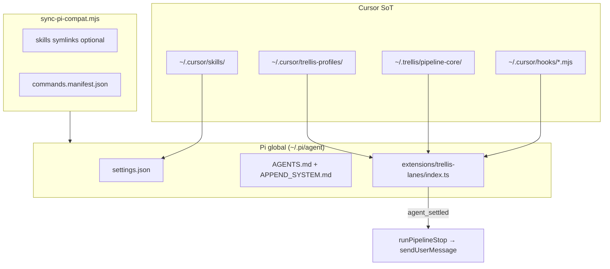

# TRL-1 — Pi agent Trellis parity pack

**Spec child:** TRL-2 · **Status:** spec queue → executor

## Goal

Transport adapter + sync pack so global Pi (`~/.pi/agent`) matches Cursor/OpenCode
Trellis fluency. **Cursor remains source of truth**; Pi imports
`~/.cursor/hooks/*.mjs` and `~/.trellis/pipeline-core/` — no duplicated policy.

Reference: [`~/.cursor/docs/opencode-compat.md`](file:///Users/trentbrew/.cursor/docs/opencode-compat.md)

## Parity matrix (Cursor vs OpenCode vs Pi)

| Capability | Cursor | OpenCode | Pi (target) |
| --- | --- | --- | --- |
| `trellis-agent-*` skills | `~/.cursor/skills/` | sync → `~/.config/opencode/skills/` | `settings.skills` → `~/.cursor/skills` |
| `/tr-*` binds | `~/.cursor/commands/` | sync → commands/ | `registerCommand` in extension |
| Session lanes | `sessionStart` hook | `session.created` | `session_start` |
| Role bind | `beforeSubmitPrompt` | `chat.message` | `input` + `registerCommand` |
| Pipeline auto-advance | `stop` → followup | `session.idle` → prompt | `agent_settled` → `sendUserMessage` |
| Verification gates | `pipeline-run.mjs` | same (shared) | same (shared) |
| Lane guard | `beforeShellExecution` | `tool.execute.before` | `tool_call` |
| Session briefing | `sessionStart` | system transform | `before_agent_start` (once) |
| Human A/B/C | `trellis-pipeline-decision.mjs` | `chat.message` | `input` handler |
| Coordination rules | `trellis-coordination.mdc` | session context builder | `AGENTS.md` + extension inject |
| MCP | native | varies | **out of scope** (extension follow-up) |

Bindings namespace: `pi:<sessionId>` → `~/.cursor/trellis-profiles/sessions/pi_*.json`

## Architecture



## File map

| Path | Phase | Purpose |
| --- | --- | --- |
| `~/.pi/agent/settings.json` | A | `"skills": ["~/.cursor/skills"]`, `enableSkillCommands: true` |
| `~/.pi/agent/AGENTS.md` | A | Coordination primer (binds, lanes, issue-first, pipeline footer) |
| `~/.pi/agent/APPEND_SYSTEM.md` | A | Trimmed founder context (~1KB from `trent-context.mdc`) |
| `~/.cursor/docs/pi-compat.md` | B | Ops doc mirroring opencode-compat.md |
| `~/.cursor/scripts/sync-pi-compat.mjs` | B | Skills symlinks + commands manifest |
| `~/.cursor/scripts/pi-sync-smoke.mjs` | B | Verify sync outputs |
| `~/.pi/agent/extensions/trellis-lanes/index.ts` | C | Extension skeleton importing shared libs |
| `~/.pi/agent/extensions/trellis-lanes/commands.manifest.json` | B/C | Generated `/tr-*` role list |

## Extension event mapping

| Pi `ExtensionAPI` | Shared lib / behavior |
| --- | --- |
| `session_start` | `buildSessionStartContext`, `ensureSessionLaneForTab`, set `process.env` |
| `input` | `parseBindCommand`, `parsePipelineToggle`, bind router on first prompt |
| `registerCommand('tr-pipeline', …)` | `saveSessionBinding` with `pipeline_auto: true` |
| `registerCommand('tr-strategist', …)` etc. | Profile bind from `trellis-profile-lib.mjs` |
| `before_agent_start` | Session briefing once + per-turn compact reminder + skill excerpt |
| `tool_call` | `evaluateLaneGuard` on bash/edit/write |
| `tool_execution_end` | `appendShellEvidence` for verification |
| `agent_settled` | `runPipelineStop` → `ctx.sendUserMessage(followup)` or pause recap |
| `session_shutdown` | Lane gc (shared v4 lifecycle lib when available) |

**ESM cache-bust:** use `?v=<mtime>` on dynamic imports (copy OpenCode `fresh()` helper).

**Binding key:** `pi:${ctx.sessionManager.getSessionId()}`

## Phase A — static config

### `settings.json` merge

Preserve existing keys (`defaultProvider`, `packages`, etc.). Add:

```json
{
  "skills": ["~/.cursor/skills"],
  "enableSkillCommands": true
}
```

### `AGENTS.md` sections (required)

1. Trellis issue-first discipline (`trellis issue active` → `start`)
2. Bind commands: `/tr-pipeline`, `/tr-strategist`, `/tr-architect`, `/tr-executor`, `/tr-reviewer`, `/tr-manager`, `/tr-misc`
3. Handoffs in Trellis-VCS issues — turn banner + YAML footer
4. Lane writes only; never edit `.trellis/` directly
5. Pointer: load bound skill via `/skill:trellis-agent-<role>`

### `APPEND_SYSTEM.md`

Extract body from `~/.cursor/rules/trent-context.mdc` (strip frontmatter), cap ~1500 chars.

## Phase B — sync + docs

`sync-pi-compat.mjs` mirrors `sync-opencode-compat.mjs`:

- Symlink `trellis-*`, `trellis-handoffs`, `sakurai` → `~/.pi/agent/skills/` (optional if settings path suffices; symlinks aid offline discovery)
- Generate `commands.manifest.json` from `~/.cursor/trellis-profiles/*.json`
- `--workspace` not required for v1 (global only)
- `managed-by: sync-pi-compat.mjs` header on generated files

`pi-sync-smoke.mjs`: verify settings, AGENTS.md, manifest, extension file exist.

## Phase C — extension skeleton

Minimal `index.ts` that:

1. Loads helpers via dynamic import (same as OpenCode plugin)
2. Registers `/tr-pipeline` and `/tr-strategist` (MVP); loop manifest for remaining roles
3. Implements `session_start` + `agent_settled` stubs wired to shared libs
4. `tool_call` lane guard for `bash` tool
5. Logs `[trellis-pi]` on load

**Do not** duplicate pipeline policy — delegate to `pipeline-run.mjs`.

## Out of scope (follow-up issues)

- MCP bridge extension
- Pi agent smoke / Playwright gates
- `pi-lane-smoke.mjs` / `pi-pipeline-smoke.mjs` (note in pi-compat.md verify section)
- npm `pi` package publish for trellis-lanes

## Acceptance criteria

```text
test: settings.json skills path + enableSkillCommands
test: AGENTS.md exists with Trellis primer
test: APPEND_SYSTEM.md exists
test: ~/.cursor/docs/pi-compat.md with parity matrix
test: sync-pi-compat.mjs --dry-run exits 0
test: trellis-lanes/index.ts references agent_settled
test: pi-sync-smoke.mjs exits 0
```

Behavioral: `/tr-pipeline` bind documented; `pi:<sessionId>` namespace documented.

## Verify (manual, post-impl)

1. `cd` Trellis spoke, start `pi`, confirm `~/.cursor/trellis-profiles/sessions/pi_*.json`
2. `/tr-pipeline` → binding `pipeline_auto: true`
3. `/skill:trellis-agent-strategist` lists in skill picker
4. Complete HANDOFF footer pass → auto follow-up on settle

## Dependencies

| File | Role |
| --- | --- |
| `~/.config/opencode/plugins/trellis-lanes.ts` | Reference implementation |
| `~/.cursor/scripts/sync-opencode-compat.mjs` | Sync script template |
| Pi `ExtensionAPI` docs | `agent_settled`, `sendUserMessage`, `session_start` |

## Manager ownership

Agent E maintains sync script + pi-compat.md after Cursor skill/command edits.
