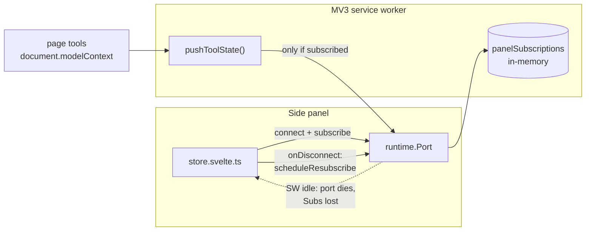

# TRL-12 — Panel re-subscribes after MV3 service worker restart

**Parent:** TRL-1 · **Labels:** `needs-e2e` · **Practice:** [`docs/issues/README.md`](../README.md)

## Goal

Newly registered page tools must reach the side panel without a manual page
reload. Today the panel silently stops receiving pushed tool-state once the MV3
service worker spins down, and only a tab event (or a reload) revives it.

## Out of scope

- Background-side persistence of `panelSubscriptions` (a `chrome.storage.session`
  rehydrate is the durable fix; this wedge fixes the panel side only).
- Backoff / retry ceilings — a single debounced reconnect covers the observed
  failure. Repeated flapping is a follow-up.
- Trace and console backfill semantics after reconnect.
- The `ChatComposer` shadow tweak riding in the same working tree (cosmetic,
  unrelated).

## Architecture



## Root cause

| Symptom | Cause |
| --- | --- |
| Tools registered after the panel has idled never appear | SW spin-down drops the port **and** the background's in-memory `panelSubscriptions` map |
| Reloading the page "fixes" it | The tab event re-triggers `subscribeToActiveTab()`, rebuilding the subscription |
| No error surfaces | `pushToolState` has no subscriber to push to — a no-op, not a failure |

## Implementation contract

| File | Change |
| --- | --- |
| `src/lib/webmcp/store.svelte.ts` | `port.onDisconnect` calls `scheduleResubscribe()` when `initialized`; new 300ms-debounced `scheduleResubscribe()` re-sends `subscribe` for `mcpState.tabId`, falling back to `subscribeToActiveTab()` |
| `src/lib/webmcp/store.reconnect.test.ts` | **new** — regression test with faked `chrome.runtime` / `chrome.tabs` and a `$state` identity shim |
| `.trellis/browser-suites/browser-smoke.json` | **new** — live-tab steps against `test-page/index.html` |
| `.trellis/tests.json` | Suites repointed to runners that exist (`unit`, `check`, `browser-smoke`) |

## Acceptance criteria

```text
test: pnpm test
test: pnpm check
store.reconnect.test.ts asserts a 2nd chrome.runtime.connect after port disconnect
store.reconnect.test.ts asserts the re-subscribe carries the original tabId (42)
regression test observed RED against pre-fix store.svelte.ts (journal)
trellis browser verify browser-smoke  # needs relay + test page in active tab
```

## Deps map

| Dependency | Status |
| --- | --- |
| `vitest` unit runner | ✅ installed |
| `trellis browser relay` / `verify` | ✅ CLI present |
| `$state` rune under plain-node vitest | ⚠️ shimmed in test; no svelte compile step for `.svelte.ts` |
| Background-side subscription persistence | ⏳ follow-up wedge |
