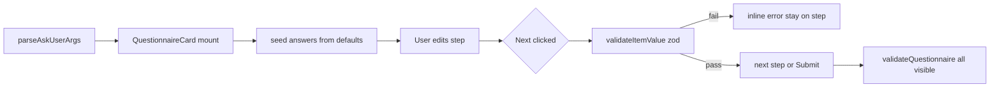

# TRL-20 — Questionnaire validation + inference defaults

**Labels:** `spec`, `needs-e2e`, `webmcp`, `chat`  
**Parent:** TRL-14

## Problem

Human feedback on WebMCP Travel demo:

1. **Over-questioning** — prompt *"ORD→OAK next summer for 2 months"* spawned four blank forms (year, outbound, inbound, passengers) when most fields were inferable.
2. **No value validation** — date step accepted `1997`; `validateQuestionnaire` only checks presence, not on **Next**.

## Goal

Extend `ask_user` with declarative constraints and defaults. Enforce with **zod** at parse + per-step UI. Guide the model to infer first and confirm rather than re-ask.

## Scope (v1)

| Layer | Deliverable |
| --- | --- |
| Schema | `QuestionnaireItem.default`, `.validation`, `.when` (generalize visibility) |
| Runtime | `buildItemValueSchema()` + `validateItemValue()` in `questionnaire.ts` |
| UX | Pre-fill defaults; block **Next**/**Submit** on invalid values; inline error |
| HTML | Wire `min`/`max`/`pattern`/`minlength`/`maxlength` from constraints |
| Baseline | `date` inputs without `validation.minDate` → default `minDate: today` |
| Prompts | `CHAT_SYSTEM_PROMPT` + `ask_user` tool description: infer → default → ask only gaps |
| Tests | Unit tests in `questionnaire.test.ts`; e2e rejects invalid departure date |

**Out of scope:** full JSON Schema / arbitrary zod from agent; page-tool parameter validation.

## Data model

```typescript
type QuestionnaireValidation = {
  min?: number;           // number inputs
  max?: number;
  minLength?: number;     // text
  maxLength?: number;
  pattern?: string;       // regex source (no flags)
  minDate?: string;       // YYYY-MM-DD or literal "today"
  maxDate?: string;
  message?: string;       // override first error string
};

type QuestionnaireItem = {
  // existing fields…
  default?: string | string[];  // pre-fill (multiple when item.multiple)
  validation?: QuestionnaireValidation;
  when?: Record<string, string | string[]>;  // visibility gate
};
```

### `ask_user` tool schema additions (`toOllamaTools.ts`)

Document `default`, `validation`, and `when` on each item. Example agent payload for travel:

```json
{
  "name": "outboundDate",
  "prompt": "Confirm departure date",
  "default": "2027-06-01",
  "input": { "label": "Departure", "inputType": "date" },
  "validation": { "minDate": "today" }
}
```

### Prompt guidance (inference-first)

`CHAT_SYSTEM_PROMPT` and `ask_user` description must state:

- Infer values from the user's message before calling `ask_user`.
- Pass inferred values as `default` on items; user edits in one short questionnaire.
- Only include items that are genuinely ambiguous (target 1–2 items, not 4 blank forms).
- Use `validation` for dates/numbers the page tool requires.

## Validation flow



## Files

| File | Change |
| --- | --- |
| `package.json` | add `zod` dependency |
| `src/lib/ai/questionnaire.ts` | types, zod builders, `validateItemValue`, `when` visibility, date baseline |
| `src/lib/components/chat/QuestionnaireCard.svelte` | defaults seed, per-step validation, HTML attrs |
| `src/lib/webmcp/toOllamaTools.ts` | extend `ask_user` parameters |
| `src/lib/ai/config.ts` | inference-first system prompt |
| `src/lib/chat/questionnaire.test.ts` | validation + defaults + when |
| `e2e-harness/questionnaire-main.ts` | add `validation` on outbound date |
| `e2e/questionnaire.spec.ts` | reject invalid past date on Next |

## Acceptance criteria

```text
test: pnpm check
test: pnpm test
test: pnpm test:e2e e2e/questionnaire.spec.ts
parseAskUserArgs accepts default and validation on items
validateItemValue rejects date before minDate (including baseline today for date inputs)
QuestionnaireCard blocks Next with inline error for invalid value
answers seed from item.default on mount
when object gates visibility (replace hardcoded inboundDate name check)
ask_user tool schema documents default, validation, when
CHAT_SYSTEM_PROMPT instructs infer-first + prefill defaults
```

## Manual verify

1. Reload extension; open WebMCP Travel; prompt *"ORD→OAK next summer 2 months"*.
2. Agent should pass fewer items with defaults (model-dependent); confirm fields pre-filled when provided.
3. On date step, enter a year in the past → **Next** shows error, cannot advance.
4. Valid future date → advances and submits.
